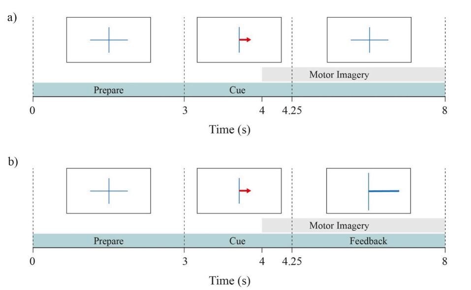
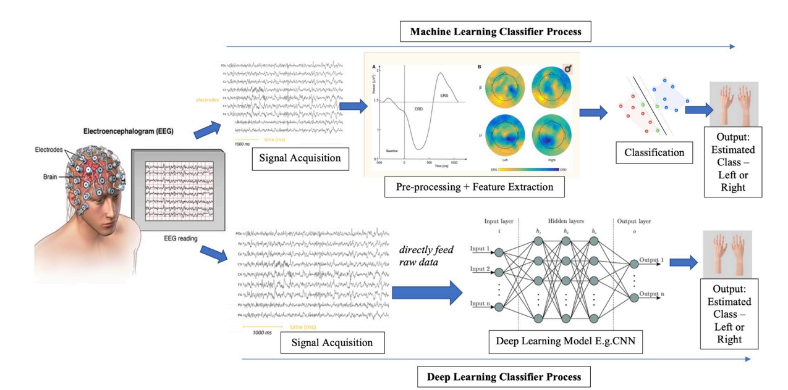
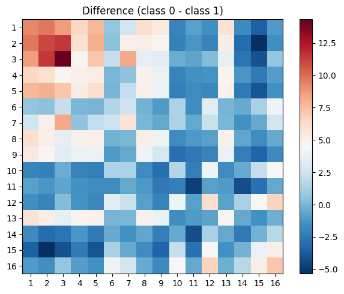
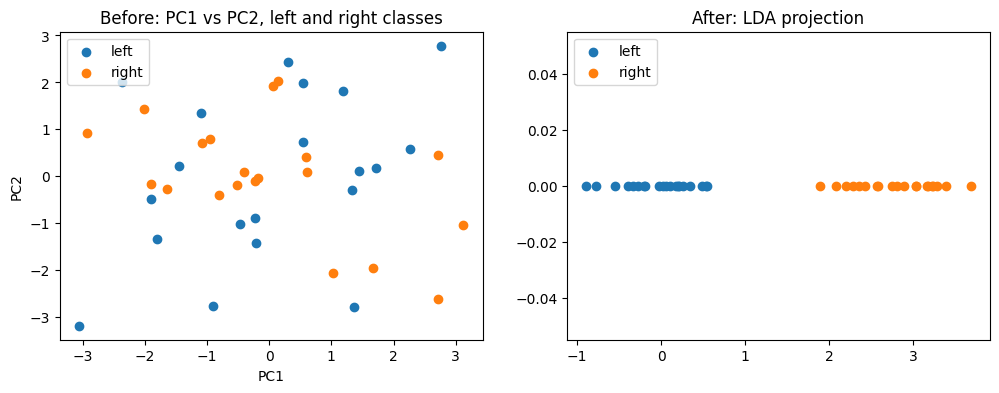

# Motor Imagery BCI : Reproducing Tibrewal et al. (2022)

Motor imagery is a paradigm used for developing brain-computer interfaces (BCIs). This project attempts to reproduce the results of Tibrewal et al. 2022. In essence, the authors show that deep Math and Implementation based classification techniques are more suited than traditional ML methods when it comes to inefficient BCI users.

Under active development.

I want to develop this repository as a walk through of the paper rather than just reproducing results. Some of the things I want to focus on are:

1. **Building intuition for BCI pipelines**: find ways to explain the pipeline involved for BCI experiments more intuitively with minimal technical details. I want to make fascinating scientific ideas accessible and digestible for everyone. This includes writing non-technical briefs about every of the project found in the `intuition` folder.

2. **Code for the pipeline**: the code in this repository is written from scratch and avoids using the repository referred to in the paper. The idea is to learn and not follow a plug and play style. All params used are directly in correspondence from the paper.

3. **Deep dive into Machine learning/ Deep Learning**: again, I want to avoid using only wrappers of popular libraries wherever feasible. I try to do this by working out the math and implement building blocks of the techniques used. Folders with the `understand` prefix are used for this. They contain math behind the methods and implementations in jupyter notebooks.

4. **Software development standards**: aim is to keep the code as clean as possible. Modularized, documented, version controlled and easy entry points to crucial scripts. 

If you think I could use some feedback, feel free to open an issue :D

  
   

## Index
**Project Stages**
1. [Data Preparation](#1-data-preparation)
2. [Math and Implementation CSP](#2-math-and-implementation-csp)
3. [Math and Implementation LDA](#3-math-and-implementation-lda)
4. [CSP + LDA Pipeline](#4-csp-lda-pipeline)
5. [Math and Implementation CNNs](#5-Math and Implementation-cnns)
5. [Math and Implementation CNNs](#5-Math and Implementation-cnns)

**Setup and Usage**
- coming soon

---

## Current Stage: 5: Implement CNNs on Calibration 

## 1: Data Preparation
- [x] Load raw calibration EEG data per participant
- [x] Epoch data around task window
- [x] Extract labels

## 2: Math and Implementation CSP
Refer to `understand_CSP` folder for a more in-depth understanding of of Common Spatial Patterns.

- [x] Covariance matrix computation
- [x] Generalized eigenvalue decomposition
- [x] Spatial filter extraction and log-variance features

## 3: Math and Implementation LDA 
Refer to `understand_LDA` folder for indepth knowledge behind LDA. 

- [x] Add folder implementation behind LDA
- [x] Explain essential math

## 4: CSP - LDA Pipeline
- [x] Add filter-bank technique to existing CSP methods
- [x] Train calibration data on CSP + LDA and evaluate using stratified k-fold cross validation

## 5: Math and Implementation CNNs
- [ ] CNNs Logic, Math and Toy implementation
- [ ] Train CNNs on calibration data

